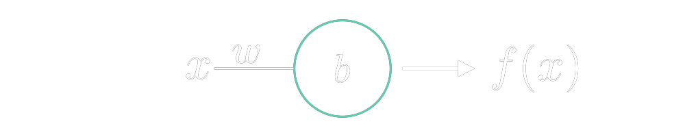

# Mathematics
A repository for experimenting with Maths.

### Table of Contents
- [Linear Algebra](#linear-algebra)
  - [Vectors](#vectors)
    - [Vector Arithmetic](#vector-arithmetic)
    - [Imaginary Numbers as Vectors](#imaginary-numbers-as-vectors)
  - [Matrices](#matrices)
    - [Matrix Arithmetic](#matrix-arithmetic)
- [Calculus](#calculus)
  - [Pre-Calc](#pre-calc)
    - [Functions](#functions)
  - [Derivatives](#derivatives)
  - [Integrals](#integrals)
  - [Differential Equations](#differential-equations)
  - [Multi-Dimensional Calculus](#multi-dimensional-calculus)
  - [Convolutions](#convolutions)
- [Machine Learning](#machine-learning)
  - [Neural Network](#neural-network)
    - [Introduction](#introduction)
  - [Forward Propagation](#forward-propagation)
  - [Back Propagation](#back-propagation)


&nbsp;
# Linear Algebra
> ### pre-requisites
> - Algebra
 ## Vectors
  ### Vector Arithmetic
  ### Imaginary Numbers as Vectors

 ## Matrices
  ### Matrix Arithmetic


&nbsp;
# Calculus
> ### pre-requisites
> - Algebra
> - Trigonometry

 ## Pre-Calc
  ### Functions
  > ## Functions can also be represented in code:
  > ```py
  > def some_polynomial_function(x: float) -> float:
  >    return 3*x*x + 7*x + 14
  > ```
  > 
  > A limitation due to the discrete nature of digital computers is that any 
  > `function` also becomes discrete. Although ${f(x) = 2x^2 + 7x + 14}$ is 
  > a continuous `function` both the input to the `function` $x$ and  
  > the output are floats, and as such they have a limited range 
  > and precision.
  > 
  > Here is another example that more clearly demonstrates this:
  > ```rs
  > fn another_polynomial_function(x: i32) -> i32 {
  >    (0.5 as i32)*x
  > }
  > ```
  > This translates to ${f(x) = {1\over2}x}$ and the domain is as follows:
  > $${D: \{x| x \in \mathbb{R}\}}$$
  > 
  > However The domain of an `i32` is: 
  > $${D: \{x| -2^{31} \le x <2^{31} | x \in \mathbb{I}\}}$$
  > Additionaly an input of ${x = 1}$ would return $0.5$, but since an `i32` 
  > cannot represent fractional values, it would return $0$;

 ## Derivatives

 ## Integrals

 ## Differential Equations

 ## Multi-Dimensional Calculus

 ## Convolutions


&nbsp;
# Machine Learning
> ### pre-requisites
> - [Calculus](#calculus) 
> - [Linear Algebra](#linear-algebra)

 ## Neural Network
  ### Introduction
  

  The figure above dipects a simple `neural network` with one input, one node, and one output. This can be read as.

  $$f(x) = wx + b$$

  The following table represents inputs passed to the netwrok above and what the expected outputs should be. From this data we hope that our `neural network` can decipher the correct relationship (`function`) between $x$ and $f(x)$.

  <center>

  | Input - $x$ | Expected Output - $f(x)$ |
  | :---------: | :----------------------: |
  |      0      |            2             |
  |      1      |            5             |
  |      2      |            8             |
  |      3      |            11            |

  </center>

 ## Forward Propagation

 ## Back Propagation