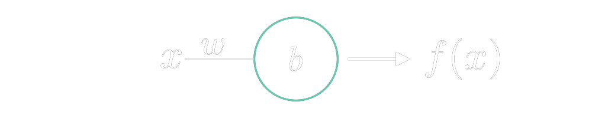
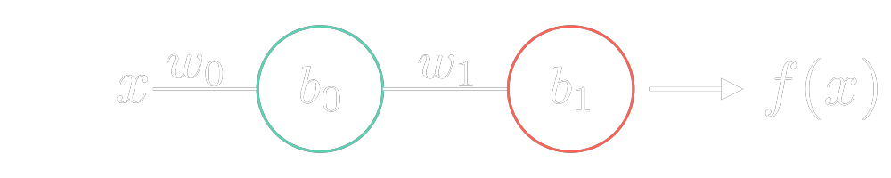
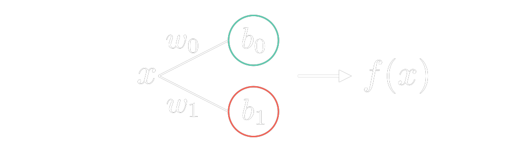
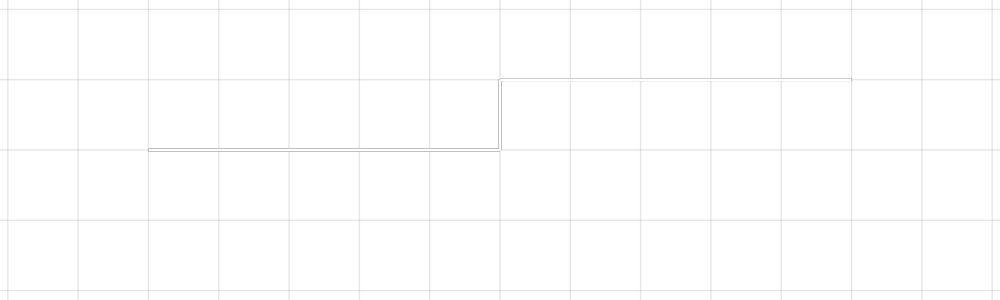
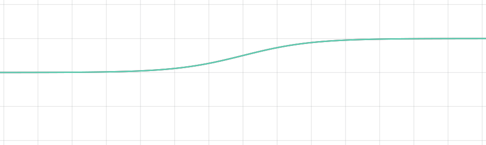

# Mathematics
A repository for experimenting with Maths.

### Table of Contents
- [Linear Algebra](#linear-algebra)
  - [Vectors](#vectors)
    - [Vector Arithmetic](#vector-arithmetic)
    - [Imaginary Numbers as Vectors](#imaginary-numbers-as-vectors)
  - [Matrices](#matrices)
    - [Matrix Arithmetic](#matrix-arithmetic)
- [Calculus](#calculus)
  - [Pre-Calc](#pre-calc)
    - [Functions](#functions)
  - [Derivatives](#derivatives)
    - [Extrema](#extrema)
  - [Integrals](#integrals)
  - [Differential Equations](#differential-equations)
  - [Multi-Dimensional Calculus](#multi-dimensional-calculus)
  - [Convolutions](#convolutions)
- [Machine Learning](#machine-learning)
  - [Neural Network](#neural-network)
    - [Approximating Relationships](#approximating-relationships)
    - [Upgrading the Network](#upgrading-the-network)
  - [Boundary Detection](#boundary-detection)
  - [Forward Propagation](#forward-propagation)
  - [Back Propagation](#back-propagation)


&nbsp;
# Linear Algebra
> ### pre-requisites
> - Algebra
 ## Vectors
  ### Vector Arithmetic
  ### Imaginary Numbers as Vectors

 ## Matrices
  ### Matrix Arithmetic


&nbsp;
# Calculus
> ### pre-requisites
> - Algebra
> - Trigonometry

 ## Pre-Calc
  ### Functions
  > ## `Functions` can also be represented in code:
  > ```py
  > def some_polynomial_function(x: float) -> float:
  >    return 3*x*x + 7*x + 14
  > ```
  > 
  > A limitation due to the discrete nature of digital computers is that any 
  > `function` also becomes discrete. Although ${f(x) = 2x^2 + 7x + 14}$ is 
  > a continuous `function` both the input to the `function` $x$ and  
  > the output are floats, and as such they have a limited range 
  > and precision.
  > 
  > Here is another example that more clearly demonstrates this:
  > ```rs
  > fn another_polynomial_function(x: i32) -> i32 {
  >    (0.5 as i32)*x
  > }
  > ```
  > This translates to ${f(x) = {1\over2}x}$ and the domain is as follows:
  > $$ {D: \lbrace x| x \in \mathbb{R} \rbrace} $$
  > 
  > However The domain of an `i32` is: 
  > $$ {D: \lbrace x| -2^{31} \le x <2^{31} | x \in \mathbb{I} \rbrace} $$
  > Additionaly an input of ${x = 1}$ would return $0.5$, but since an `i32` 
  > cannot represent fractional values, it would return $0$;

 ## Derivatives
  ### Extrema
  

 ## Integrals

 ## Differential Equations

 ## Multi-Dimensional Calculus

 ## Convolutions


&nbsp;
# Machine Learning
> ### pre-requisites
> - [Calculus](#calculus) 
> - [Linear Algebra](#linear-algebra)

 ## Neural Network
  ### Approximating Relationships
  

  The figure above dipects a simple `neural network` with one input $x$, one weight $w$, and one bias at the output $b$. This can be read as;

  $$ f(x) = wx + b $$

  The following table represents inputs passed to the network above and what the expected outputs should be. From this data we hope that our `neural network` can decipher the correct relationship (i.e. `function`) between $x$ and $f_e(x)$.

  | Input - $x$ | Expected Output - $f_e(x)$ |
  | :---------: | :------------------------: |
  |      0      |             2              |
  |      1      |             5              |
  |      2      |             8              |
  |      3      |             11             |

  To start, we inititalze the constants $w, b$ with arbitrary values; in our case $1$. 
  
  $$ f(x) = 1x + 1 $$

  We can then compare the Error $E$ between the expected result and the calculated result at every $x$. It is arbitrary how the error funtion is contructed so long as it describes the difference between $f(x)$ and $f_e(x)$, so choosing one that is simple to derive is more practical. Our error `function` will be the square of the differece;

  $$ E_x(w, b) = (f_e(x) - f(x))^2 $$
  $$ --- $$
  $$ E_0(1, 1) = (f_e(0) - f(0))^2  = (2 - (1(0) + 1))^2 = 1$$


  The Gradient of the error indicates the direction of steepest change and can be found using partial derivatives. Using these partial derivatives we can minimize the error for each individual $x$.

  The gradient is;
  $$ \Delta{E} = ({\delta{E}\over\delta{w}}, {\delta{E}\over\delta{b}}) $$
  
  The partial derivatives are;

  $$ {\delta{E}\over\delta{w}} = {\delta\over\delta{w}}(f_e(x) - f(x))^2 $$

  $$ {\delta\over\delta{w}}(f_e(x) - f(x))^2 = 2(f_e(x) - f(x)) {-\delta{f(x)}\over\delta{w}} $$

  $$ {\delta{f(x)}\over\delta{w}} = {\delta{w}\over\delta{w}}x + {\delta{b}\over\delta{w}} = x $$

  $$ {\delta{E}\over\delta{w}} = -2x(f_e(x) - f(x)) $$

  $$ --- $$

  $$ {\delta{E}\over\delta{b}} = {\delta\over\delta{b}}(f_e(x) - f(x))^2$$

  $$ {\delta\over\delta{b}}(f_e(x) - f(x))^2 = 2(f_e(x) - f(x)) {-\delta{f(x)}\over\delta{b}} $$

  $$ {\delta{f(x)}\over\delta{b}} = {\delta{w}\over\delta{b}}x + {\delta{b}\over\delta{b}} = 1 $$

  $$ {\delta{E}\over\delta{b}} = -2(f_e(x) - f(x)) $$

  Since we are looking for a minimum of the error `function`, we can nudge the variables to the right if their respective derivative is negative and left is positive. (A minimum can be found if a `function` is decreasing to the left and increasing to the right.) This means we can nudge the variables negatively proportional to their partial derivatives to gradually locate a minimum. This process if formally known as [Stochastic Gradient Descent](https://en.wikipedia.org/wiki/Stochastic_gradient_descent).

  $$ {\delta{E_0}\over\delta{w}} = 2(0)(f_e(0) - f(0)) $$
  $$ {\delta{E_0}\over\delta{w}} = 0 $$
  
  $$ --- $$
  
  $$ {\delta{E_0}\over\delta{b}} = -2(f_e(0) - f(0)) $$
  $$ {\delta{E_0}\over\delta{b}} = -2(2 - (1(0) + 1)) = -2(1) $$
  $$ {\delta{E_0}\over\delta{b}} = -2 $$

  Since $\delta{E_0}\over\delta{w}$ is $0$ we cannot determine which direction to nudge the variable $w$. $\delta{E_0}\over\delta{b}$ on the other hand is negative; at $x=0$ the error $E$ is decreasing with respect to $b$. This means we can nudge $b$ in the positive direction.

  $$ w_{new} = w_{old} - {\delta{E_0}\over\delta{w}} $$
  $$ w_{new} = 1 - 0 $$
  $$ w_{new} = 1 $$

  $$ --- $$

  $$ b_{new} = b_{old} - {\delta{E_0}\over\delta{b}} $$
  $$ b_{new} = 1 - (-1) $$
  $$ b_{new} = 2 $$

  Our equation is now;

  $$ f(x) = 1x + 2 $$

  We can continue this process for each entry in the dataset to slowly approximate the the `function` we are looking for. In this case we would get something close to $f(x) = 3x + 2$.

  > ### Note
  > The process above is a simplified explanation of how some more complex neural networks operate. It is important to note that a neural network is a means to be able to approximate relationships (`functions`) between inputs and outputs without needing to implement the realationships by hand. In the simple example above, it would be faster to calculate the linear `function` from the dataset rather than try to approximate it. This is because linear `functions` are easy to work with. More complex relationships - higher order polynomials, trigonometric `functions`, and even relationship between individual pixels and the resulting image - are not easily calculated. Instead we can approxiamte these relationships by creating a large neural network and feeding them even larger datasets.
  >
  > It is important to understand that the neural network above will transform to approximate 1 and only 1 relationship. If given data from two different linear `functions`, it will be a bad approximation for both.
  >
  > The next section will be building the nueral to make it more capable of predicting higher order polynomial relationships

  ### Upgrading the Network
  To start lets make the network capable of approximating second order polynomials. Here is the dataset we will be using;

  | Input - $x$ | Expected Output - $f_e(x)$ |
  | :---------: | :------------------------: |
  |      0      |             1              |
  |      1      |             4              |
  |      2      |             9              |
  |      3      |             16             |

  Taking a look at the neural nework from the previous section we can see that with only one weight and one bias we can only construct relationships that look like $f(x) = wx + b$. We need to increase the number of variables

  

  This can be read as $f(g(x)) = h(x) = (x * w_0 + b_0) * w_1 + b_1 = w_0w_1x + b_0w_1 + b_1$. Although we have more variables, the overall structure of the relationship is the same as in the previous network. Let $w_0w_1 = A$ and $b_0w_1 + b_1 = B$ we then have $h(x) = Ax + B$. Still we are only able to represent linear relationships. Instead of increasing the length of the network we can try increasing the width.

  

  This can be read as $f(x) + g(x) = h(x) = (w_0x + b_0) + (w_1x + b_1) = (w_0 + w_1)x + (b_0 + b_1)$. Again if we let $w_0 +w_1 = A$ and $b_0 + b_1 = B$ we get $h(x) = Ax + B$. Still we are only able to represent linear relationships.

  In fact, no matter how many weights and biases we add, our network will only ever be able to find linear relationships. To add non-linearity to our nerual network, we need to use an `Activation Function`. The activation function controls how active a node is allowed to be. the most simple of these funtions, the `unit step function`, $u(x)$, allows us to create piecewise relationships.

  $$
  u(x) = 
  \begin{cases}
  0 & \text{if } x < 0\\
  1 & \text{if } x \ge 0
  \end{cases}
  $$

  By shifting the step function before multiplying it with another function we can create piecewise functions.

  $$ f(x) = 3x*u(-x) + (2x + 7)*u(x-3)$$ 
  $$ \text{is equivalent to} $$ 
  $$ 
  f(x) =  
  \begin{cases}
  3x & \text{if } x \le 0 \\
  0 & \text{if } 0 < x < 3 \\
  2x + 7 & \text{if } 3 \ge 0
  \end{cases}
  $$

  This particular activation function allows us to aprroximate a relationship for higher order polynomials and other non-linear functions. But, our neural network is still not a good representation of non-linear functions. We can change this by using a smooth activation function, we will be using the sigmoid $\sigma(x)$ function (it is simple to derivate).

  For reference;
  $$ \sigma(x) = {1\over{1 + e^{-x}}} $$
  $$ \sigma'(x) = \sigma(x)(1-\sigma(x)) $$

  Below is a comparison of $u(x)$ and $\sigma(x)$ and their approximations of $f(x) =x^2$.
  |               $u(x)$               | &rarr; |            $\sigma(x)$             |
  | :--------------------------------: | :----: | :--------------------------------: |
  |     |        |     |
  |  |        |  |

 ## Boundary Detection

 ## Forward Propagation

 ## Back Propagation